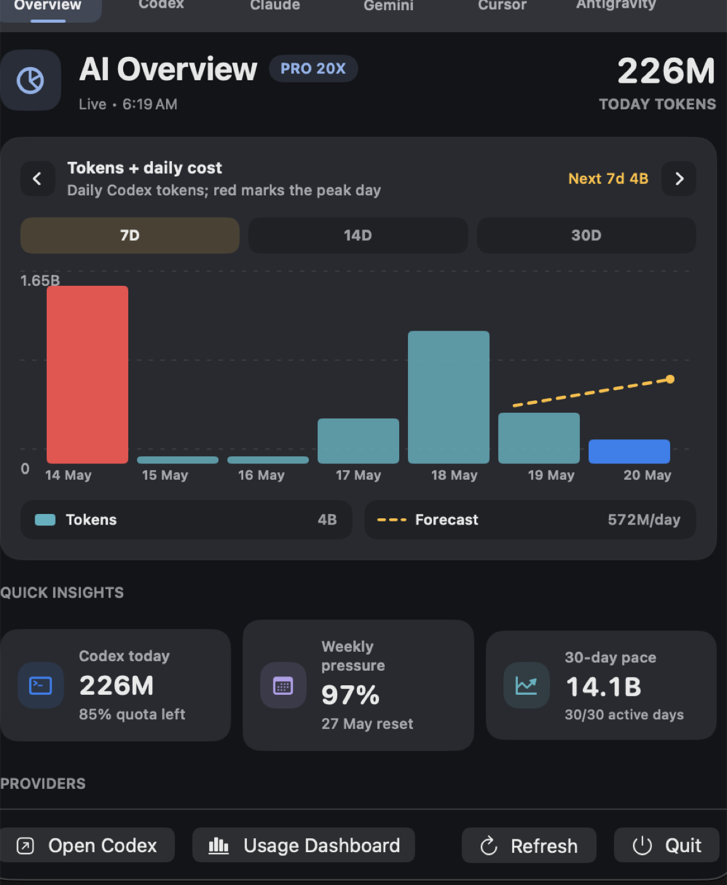
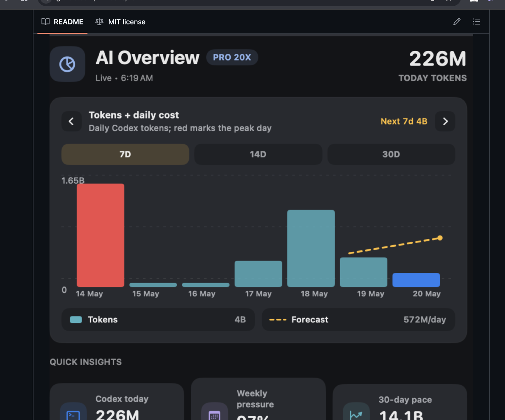
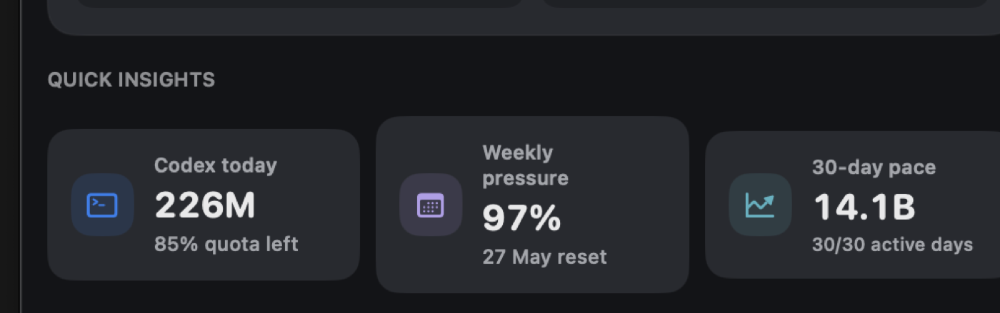

# TokenBar

**A macOS menu bar usage monitor for OpenAI Codex and AI coding agents.**

TokenBar keeps coding-agent usage visible while you work: tokens, quota pressure, reset timing, forecasted spend, and daily work rhythm from a compact macOS icon-bar surface.

It is built for heavy OpenAI Codex users first, with future connector surfaces for Claude by Anthropic, Cursor, Google coding agents, and other agentic development tools once explicit usage APIs or local exports are available.

[LinkedIn launch post](https://www.linkedin.com/posts/arnav-salkade-27076a201_a-500000-engineer-must-use-at-least-250000-activity-7462243251710763009-aluS)



## Quick Start

Install TokenBar and the terminal launcher:

```bash
curl -fsSL https://raw.githubusercontent.com/Arnie016/TokenBar/main/install.sh | bash
```

Then open it from any terminal:

```bash
tokenbar
```

The launcher installs TokenBar into `~/Applications` and adds `tokenbar` under `~/.local/bin`.

## Why It Exists

Coding agents are becoming part of daily software work, but usage limits and cost burn are still too easy to lose track of. TokenBar makes that invisible layer visible from the menu bar, so builders can see when Codex is healthy, when weekly pressure is tight, and how current usage might project forward.

## What It Shows

- OpenAI Codex token usage from local session logs
- 5-hour and weekly quota pressure
- Daily token history with peak-day highlighting
- Estimated dollar usage from local token counts
- Forecast views for usage pace and spend
- Quick Insights for today, weekly pressure, peak day, average day, and projected cost

## AI Overview

The overview is designed as a compact data-storytelling surface. The default view is a proper history line chart with a dotted projection line. Use the arrow controls to move through different views of the same usage data, including cost forecast, work rhythm, cumulative usage, spike detection, heat blocks, pace against average, peak share, weekly burn, and agent activity.





## Provider Status

TokenBar currently reads OpenAI Codex usage locally. Claude by Anthropic, Cursor, Google coding agents, and other coding-agent surfaces are shown as future connector targets until explicit usage APIs or local exports are wired in.

Browser sign-in is not treated as usage authorization. TokenBar does not read browser cookies, passwords, account secrets, or provider tokens.

## Keywords

OpenAI Codex, ChatGPT, Codex, AI coding agents, coding agent usage, token usage, token monitor, quota monitor, cost forecast, macOS menu bar app, SwiftUI, local-first, Claude Anthropic, Gemini, Cursor, Google coding agents, developer productivity, agentic coding, AI developer tools.

## Download

Latest macOS arm64 build:

[Download TokenBar](https://github.com/Arnie016/codex-goated-skills/releases/download/v0.1.0/CodexLimitBar-macOS-arm64-2026-05-20.zip)

After manual download, drag the app into `~/Applications` or `/Applications`, then run:

```bash
tokenbar
```

Because this early build is ad-hoc signed, macOS may show a Gatekeeper warning on first open.

## Status

Early public build. The current app is local-first and focused on Codex. Exact billing, purchased credits, and organization-level usage should still be verified in the official provider dashboard.
